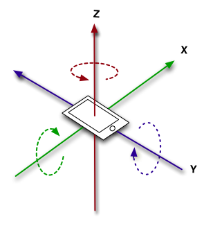
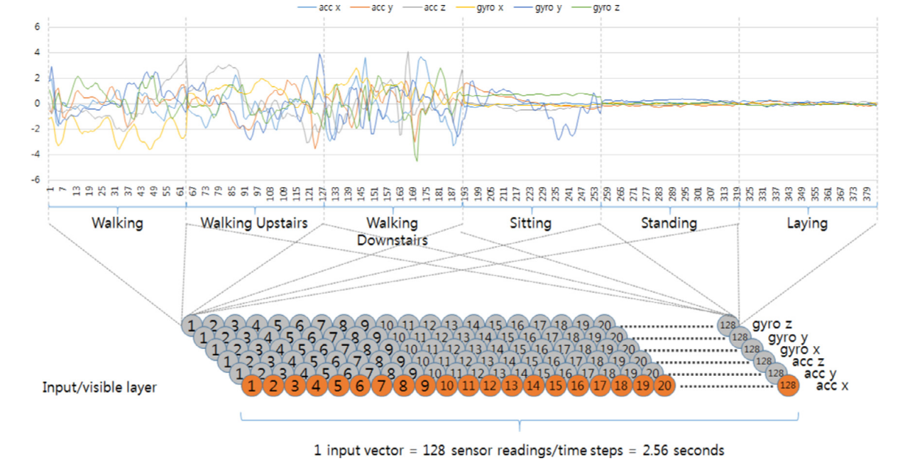
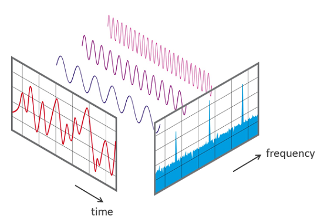

# 과제 10 센서데이터를 이용한 행동분류

## 학습 목표
-1D 센서 데이터(자이로, 가속도)를 사용하여 사람의 행동유형을 분류할 수 있다.

1D 센서 데이터를 Feature 로 기술할 수 있다.
좋은 Feature를 만들수록 분류 성능이 향상됨을 알 수 있다.

## 주의사항
성능 향상을 위해 인공신경망은 사용할 수 없다. 즉, 배운 범주내의 방법을 다양하게 활용해야함.

## 문제 시작하기
1) 먼저 아래 실습문 메뉴얼을 읽습니다.
2) 스켈레톤 코드 를 복사-편집하여 사용합니다.
3) 스켈레톤 코드 내 메뉴얼을 참고하여 [스켈레톤 코드]의 [Empty Module]을 구현합니다.
4) 결과 파일(csv)을 리더보드에 제출한다.
5) 베이스라인을 넘지 못했다면, 실습문제 메뉴얼과 스켈레톤 코드의 주석을 천천히 다시 읽어가면서 디버깅 한다.

## 개요
실습문제는 스마트폰에 장착된 자이로센서와 가속도 센서를 통해 사람의 행동을 예측하는 문제입니다.

스마트폰은 다양한 센서로 이뤄져있으며, 대표적으로는 가속도 센서와 자이로 센서가 있습니다. 가속도 센서(Accelerometer)는 X,Y,Z 축에 대한 가속도를 측정하는 센서이며, 스마트폰의 움직임을 알 수 있습니다. 다음으로는 자이로 센서(Gyroscope)는 물체의 회전속도를 측정하는 센서이며, 스마트폰의 기울임을 알 수 있습니다. 이외에도 다양한 센서가 존재하지만 해당 실습문제에서는 이 두가지 센서를 활용하게 됩니다.

## 데이터셋 설명

해당 실습문제에서는 2012년 발표된 논문인 'Human Activity Recognition on Smartphones using a Multiclass Hardware-Friendly Support Vector Machine'에서 공개한 데이터셋을 이용해 사람의 활동을 분류할 예정입니다. 해당 데이터셋에서 사람의 활동은 총 6가지로 나타내고 있습니다. 6가지 활동으로는 '1 WALKING, 2 WALKING_UPSTAIRS, 3 WALKING_DOWNSTAIRS,4 SITTING, 5 STANDING, 6 LAYING' 이 있습니다. 다시 설명하면 해당 데이터셋은 6가지의 사람의 행동을 스마트폰의 가속도 센서와 자이로 센서로 측정된 데이터로 분류하는 것을 목적으로 만들어졌습니다.

HAR 데이터셋 제작에는 총 30명의 피실험자가 참여하였으며, 데이터셋 제작에 사용된 휴대폰은 갤럭시 S2 입니다. 61번의 실험이 진행됐고, 피실험자는 앞서 언급한 6가지 동작을 스마트폰을 몸에 착용한 채로 수행하게 됩니다. 그리고 해당 데이터셋은 피실험자가 수행한 동작과 동작을 수행한 시작시간과 종료시간 등을 기록하였습니다. 센서 데이터는 50Hz를 주기로 수집됐습니다.

이번 실습문제에서는 61번의 실험에서 스마트폰으로 측정된 자이로 센서와 가속도 센서의 Raw 데이터를 가공해 Feature를 추출하고, 해당 Feature를 기반으로 총 6가지 행동을 분류문제로 해결할 예정입니다. 실습문제에서는 Raw 데이터가 사용되기 때문에 실제 Raw데이터를 잘 가공해 Feature를 추출해야하는 것이 핵심입니다. 해당 논문과 데이터셋이 촬영된 비디오 링크를 아래 추가하였으니 참고하시길 바랍니다.

## 데이터셋 불러오기
해당 실습문제에서는 데이터셋 로더를 제공합니다. 데이터를 다운받으시면 data_loader.py를 확인하실 수 있습니다. 해당 파이썬 코드에 정의되어 있는 'import_raw_signals', 'import_labels_file' 함수를 통해서 Raw 데이터를 불러오시면 됩니다. 이때 캐글 노트북으로 진행하시는 분들은 경로 설정이 중요한데 다음과 같이 설정하시면 됩니다.

    import data_loader for data loading
    from data_loader import import_raw_signals, import_labels_file,normalize5,normalize2

    Raw_data_paths = sorted(glob("/kaggle/input/2020mltermprojecthar/RawData/*"))
    Raw_acc_paths=Raw_data_paths[0:61]
    Raw_gyro_paths=Raw_data_paths[61:122]

    print (("RawData folder contains in total {:d} file ").format(len(Raw_data_paths)))
    print (("The first {:d} are Acceleration files:").format(len(Raw_acc_paths)))
    print (("The second {:d} are Gyroscope files:").format(len(Raw_gyro_paths)))
    print ("The last file is a labels file")
    print ("test labels file path is:",Raw_data_paths[122])
    print ("train labels file path is:",Raw_data_paths[123])

    raw_dic={}
    raw_acc_columns=['acc_X','acc_Y','acc_Z']
    raw_gyro_columns=['gyro_X','gyro_Y','gyro_Z']
    for path_index in range(0,61):
            key= Raw_data_paths[path_index][-16:-4]
            raw_acc_data_frame=import_raw_signals(Raw_data_paths[path_index],raw_acc_columns)
            raw_gyro_data_frame=import_raw_signals(Raw_data_paths[path_index+61],raw_gyro_columns)
            raw_signals_data_frame=pd.concat([raw_acc_data_frame, raw_gyro_data_frame], axis=1)
            raw_dic[key]=raw_signals_data_frame

    print('raw_dic contains %d DataFrame' % len(raw_dic))
    display(raw_dic['exp01_user01'].head(3))

train, test 라벨을 불러오기 위한 방법은 다음과 같습니다.

    train_raw_labels_columns=['experiment_number_ID','user_number_ID','activity_number_ID','Label_start_point','Label_end_point']
    test_raw_labels_columns=['experiment_number_ID','user_number_ID','Label_start_point','Label_end_point']

    test_labels_path=Raw_data_paths[122]
    train_labels_path=Raw_data_paths[123]

    train_Labels_Data_Frame=import_labels_file(train_labels_path,train_raw_labels_columns)
    test_Labels_Data_Frame=import_labels_file(test_labels_path,test_raw_labels_columns)

    print ("The first 3 rows of  train_Labels_Data_Frame:" )
    display(train_Labels_Data_Frame.head(3))
    print(train_Labels_Data_Frame.shape)
    display(test_Labels_Data_Frame.head(3))
    print(test_Labels_Data_Frame.shape)

## 데이터 전처리
해당 데이터셋을 제작한 저자는 논문을 통해 Raw 데이터 전처리 방법에 대해서 자세히 나타냈습니다. 먼저 RAW 데이터는 3축의 자이로 센서와 3축의 가속도계 센서를 통해 측정된 값들을 시간순서로 기록했습니다. 가장먼저 RAW 데이터에는 많은 노이즈가 있기 때문에 해당 노이즈에 대한 필터를 통해 처리를 진행해야 합니다. 논문에서 저자는 노이즈를 제거하기 위해 median filter와 3차 low pass Butterworth filter를 사용했다고 이야기합니다. 이때 Butter worth filter에 coner frequency는 20Hz로 설정했다고 합니다. 또한 가속도계 센서의 값을 body 가속도와 gravity 가속도 신호로 분리하였는데, 여기에도 Butter worth filter가 사용됐으며 이때 coner frequency는 0.3Hz로 설정했다고 합니다.

### Median Filter

    from scipy.signal import medfilt

    def median(signal):
        array=np.array(signal)   
        med_filtered=sp.signal.medfilt(array, kernel_size=3)
        return  med_filtered

### Butterworth Filter

    from scipy.fftpack import fft  
    from scipy.fftpack import fftfreq
    from scipy.fftpack import ifft
    import math 

    sampling_freq = 50
    nyq=sampling_freq/float(2)
    freq1 = 0.3
    freq2 = 20

    # Function name: components_selection_one_signal

    # Inputs: t_signal:1D numpy array (time domain signal); 

    # Outputs: (total_component,t_DC_component , t_body_component, t_noise) 
    #           type(1D array,1D array, 1D array)

    # cases to discuss: if the t_signal is an acceleration signal then the t_DC_component is the gravity component [Grav_acc]
    #                   if the t_signal is a gyro signal then the t_DC_component is not useful
    # t_noise component is not useful
    # if the t_signal is an acceleration signal then the t_body_component is the body's acceleration component [Body_acc]
    # if the t_signal is a gyro signal then the t_body_component is the body's angular velocity component [Body_gyro]

    def components_selection_one_signal(t_signal,freq1,freq2):
        t_signal=np.array(t_signal)
        t_signal_length=len(t_signal)
        f_signal=fft(t_signal)
        freqs=np.array(sp.fftpack.fftfreq(t_signal_length, d=1/float(sampling_freq)))# frequency values between [-25hz:+25hz]

        # DC_component: f_signal values having freq between [-0.3 hz to 0 hz] and from [0 hz to 0.3hz] 
        #                                                             (-0.3 and 0.3 are included)

        # noise components: f_signal values having freq between [-25 hz to 20 hz[ and from ] 20 hz to 25 hz] 
        #                                                               (-25 and 25 hz inculded 20hz and -20hz not included)

        # selecting body_component: f_signal values having freq between [-20 hz to -0.3 hz] and from [0.3 hz to 20 hz] 
        #                                                               (-0.3 and 0.3 not included , -20hz and 20 hz included)

        f_DC_signal=[] # DC_component in freq domain
        f_body_signal=[] # body component in freq domain numpy.append(a, a[0])
        f_noise_signal=[] # noise in freq domain

        for i in range(len(freqs)):# iterate over all available frequencies

            # selecting the frequency value
            freq=freqs[i]

            # selecting the f_signal value associated to freq
            value= f_signal[i]

            # Selecting DC_component values 
            if abs(freq)>0.3:# testing if freq is outside DC_component frequency ranges
                f_DC_signal.append(float(0)) # add 0 to  the  list if it was the case (the value should not be added)                                       
            else: # if freq is inside DC_component frequency ranges 
                f_DC_signal.append(value) # add f_signal value to f_DC_signal list

            # Selecting noise component values 
            if (abs(freq)<=20):# testing if freq is outside noise frequency ranges 
                f_noise_signal.append(float(0)) # # add 0 to  f_noise_signal list if it was the case 
            else:# if freq is inside noise frequency ranges 
                f_noise_signal.append(value) # add f_signal value to f_noise_signal

            # Selecting body_component values 
            if (abs(freq)<=0.3 or abs(freq)>20):# testing if freq is outside Body_component frequency ranges
                f_body_signal.append(float(0))# add 0 to  f_body_signal list
            else:# if freq is inside Body_component frequency ranges
                f_body_signal.append(value) # add f_signal value to f_body_signal list

        ################### Inverse the transformation of signals in freq domain ########################
        # applying the inverse fft(ifft) to signals in freq domain and put them in float format
        t_DC_component= ifft(np.array(f_DC_signal)).real
        t_body_component= ifft(np.array(f_body_signal)).real
        t_noise=ifft(np.array(f_noise_signal)).real

        total_component=t_signal-t_noise # extracting the total component(filtered from noise) 
                                        #  by substracting noise from t_signal (the original signal).

        # return outputs mentioned earlier
        return (total_component,t_DC_component,t_body_component,t_noise) 

이렇게 노이즈를 제거한 Raw 데이터를 이제는 고정된 크기의 윈도우로 슬라이딩 하며 샘플링을 진행했다고 합니다. 이때 샘플링한 윈도우의 크기는 시간의 단위를 가지는데 2.56초 간격으로 50%를 오버랩하며 샘플링을 수행했다고 합니다. 이때 센서 데이터는 50Hz 간격으로 측정됐기 때문에 2.56초를 계산하면 128개의 센서값을 샘플링 했다고 생각할 수 있습니다. 이러한 내용은 아래와 같은 코드로 구현이 가능합니다.

    def Windowing_type(time_sig_dic,Labels_Data_Frame):
        columns=time_sig_dic['exp01_user01'].columns
        window_ID=0
        time_dictionary_window={}
        BA_array=np.array(Labels_Data_Frame)

        for line in BA_array:
            file_key= 'exp' + normalize2(int(line[0]))  +  '_user' + normalize2(int(line[1]))

            if line.shape[0] == 5 :
            act_ID=line[2]
            start_point=line[3]
            end_point = line[4]
            else :
            act_ID='None'
            start_point = line[2]
            end_point = line[3]

            for cursor in range(start_point,end_point-127,64):
                end_point=cursor+128
                data=np.array(time_sig_dic[file_key].iloc[cursor:end_point])
                window=pd.DataFrame(data=data,columns=columns)
                key='t_W'+normalize5(window_ID)+'_'+file_key+'_act'+normalize2(act_ID)
                time_dictionary_window[key]=window
                window_ID=window_ID+1

        return time_dictionary_window 

이렇게 센서 데이터에 대한 전처리를 마쳤으면, 이제 이 센서 데이터들을 유의미한 피처로 탈바꿈해야 합니다. 앞선 과정을 통해서 3축에 대한 자이로 센서 데이터와 가속도 센서 데이터 총 6가지 센서 값을 획득할 수 있었는데, 앞서 설명한 방법으로 가속도 센서는 Body와 Gravity 가속도로 분리하여 총 9가지의 센서 데이터를 얻을 수 있었습니다. 이러한 센서 데이터는 각각 'tBodyAcc-XYZ', 'tGravityAcc-XYZ', 'tBodyGyro-XYZ'로 명명할 수 있습니다. 이제 이 9개의 데이터로 저자는 유의미한 피처를 엔지니어링 합니다.

### Jerk-속도변화량
가장 나이브한 방법으로 9가지 데이터에 대해서 각각 미분을 수행하여 각 센서들의 변화량을 피처로 추가합니다. 각 센서 데이터들을 미분하는 방법은 우리 모두가 알고 있는 그대로 수행하면 됩니다. 이러한 내용을 구현한 코드는 아래와 같습니다.

    dt=0.02 # dt=1/50=0.02s time duration between two rows
    # Input: 1D array with lenght=N (N:unknown)
    # Output: 1D array with lenght=N-1
    def jerk_one_signal(signal): 
            return np.array([(signal[i+1]-signal[i])/dt for i in range(len(signal)-1)])

이와 같이 각 센서 데이터들을 미분하고 각각을 'tBodyAccJerk-XYZ', 'tBodyGyroJerk-XYZ', 'fBodyAccJerk-XYZ' 로 명명합니다. 처음 9개(X,Y,Z 3축 * 3)의 센서 데이터에서 이제는 각각에 대한 미분량 9개(X,Y,Z 3축 * 3)가 추가돼 총 18개의 데이터를 만들었습니다.

### Mag-벡터의 크기 계산(X,Y,Z축을 통합한 크기 계산)
다음으로는 각 센서들에 크기를 계산해 피처를 생산합니다. 이때 크기는 가장 단순하게 Euclidean norm을 통해 계산하게 됩니다. 이때 크기는 앞에서 언급한 데이터들은 X,Y,Z 축에 대해서 각각 데이터를 가지고 있었지만, 이제는 각 센서마다 X,Y,Z 값을 Euclidean norm으로 계산해 크기를 구합니다. 크기를 계산하는 방법은 아래 코드와 같습니다.

    import math
    def mag_3_signals(x,y,z): # Euclidian magnitude
        return [math.sqrt((x[i]**2+y[i]**2+z[i]**2)) for i in range(len(x))]

이를 통해서 앞서 구한 센서들의 각 축을 통합하는 크기를 계산할 수 있으며, 이를 각각 'tBodyAccMag', 'tGravityAccMag', 'tBodyAccJerkMag', 'tBodyGyroMag', 'tBodyGyroJerkMag' 로 명명합니다.

### 시간 도메인에서 주파수 도메인으로 변경

앞선 피처들은 시간 도메인에서 기술된 센서데이터로 만들었다면, 저자는 주파수 도메인에서 피처를 만들어 냅니다. 시간 도메인의 데이터를 주파수 도메인으로 옮기기 위해서 모두가 배웠던 Fast Fourier Transform을 사용합니다. 이를 통해서 앞에서 계산했던 피처들을 주파수 도메인에서 한번더 기술하게 됩니다. 이를 위한 코드는 아래와 같습니다.

    from scipy import fftpack
    from numpy.fft import *

    def fast_fourier_transform_one_signal(t_signal):
        complex_f_signal= fftpack.fft(t_signal)
        amplitude_f_signal=np.abs(complex_f_signal)

        return amplitude_f_signal

    def fast_fourier_transform(t_window):
        f_window=pd.DataFrame()
        for column in t_window.columns:
            if 'grav' not in column:
                t_signal=np.array(t_window[column])
                f_signal= np.apply_along_axis(fast_fourier_transform_one_signal,0,t_signal)
                f_window["f_"+column[2:]]=f_signal
        return f_window

기존에 만든 센서들에서 t가 시간 도메인을 의미했다면 이제는 FFT를 통해 주파수 도메인으로 변환했기 때문에 t를 f로 변경해 'fBodyAcc-XYZ', 'fBodyAccJerk-XYZ', 'fBodyGyro-XYZ', 'fBodyAccMag', 'fBodyAccJerkMag', 'fBodyGyroMag', 'fBodyGyroJerkMag'로 명명합니다.

이렇게 구현한 시퀀스 센서 데이터를 기반으로 Feature를 추출합니다. 실제 해당 Feature를 추출하는 코드가 첫번째 Empty Module 입니다.

    # -------------------------------------
    # [Empty Module #1] Feature Engineering
    # -------------------------------------

    # -------------------------------------
    # Feature Engineering
    # -------------------------------------
    # 목적: 제공된 36개의 시퀀스 도메인 데이터를 기반으로 피처모델링을 수행한다.
    # 입력인자: 시간(time) 도메인 Feature 20개 , 주파수(frequency) 도메인 Feature 16개
    # 출력인자: 분류모델 학습을 위한 Feature
    # -------------------------------------

    # ------------------------------------------------------------
    # 논문에서 제안하는 Feature Engineering 방법
    # ------------------------------------------------------------
    #
    # mean(): Mean value
    # std(): Standard deviation
    # mad(): Median absolute deviation 
    # max(): Largest value in array
    # min(): Smallest value in array
    # sma(): Signal magnitude area
    # energy(): Energy measure. Sum of the squares divided by the number of values. 
    # iqr(): Interquartile range 
    # entropy(): Signal entropy
    # arCoeff(): Autorregresion coefficients with Burg order equal to 4
    # correlation(): correlation coefficient between two signals
    # maxInds(): index of the frequency component with largest magnitude
    # meanFreq(): Weighted average of the frequency components to obtain a mean frequency
    # skewness(): skewness of the frequency domain signal 
    # kurtosis(): kurtosis of the frequency domain signal 
    # bandsEnergy(): Energy of a frequency interval within the 64 bins of the FFT of each window.
    # angle(): Angle between to vectors.

Feature를 추출한 이후 데이터 정규화를 진행하고, RandomForest를 통한 분류를 수행합니다.

데이터 정규화와 RandomForest 분류는 수업시간에 다뤘으므로 추가적인 설명은 하지 않겠습니다.

    # -------------------------------------
    # [Empty Module #2] Data Normalization
    # -------------------------------------

    # -------------------------------------
    # Data Normalization
    # -------------------------------------
    # 목적: 앞서 구축한 train,test 셋에 대한 Feature를 정규화한다.
    # 입력인자: train 셋에서 추출된 Feature, test 셋에서 추출된 Feature
    # 출력인자: 정규화된 Feature Vector
    # -------------------------------------

    from sklearn.preprocessing import MinMaxScaler

    # ------------------------------------------------------------
    # 구현 가이드라인 
    # ------------------------------------------------------------
    # sklearn에서 제공하는 MinMaxScaler를 사용해 데이터 정규화를 진행한다.
    # (MinMaxScaler가 아닌 다른 정규화를 사용할 수 있다.)
    # ------------------------------------------------------------
---
    # -------------------------------------
    # [Empty Module #3] RandomForest를 이용한 분류
    # -------------------------------------

    # -------------------------------------
    # RandomForest를 이용한 분류
    # -------------------------------------
    # 목적: 앞서 완성한 train/test Feature를 RandomForest를 이용해 분류한다.
    # 주의사항 : 베이스라인의 성능은 random_state를 42로 설정한 결과이다.
    # 입력인자: Feature vector(train/test)
    # 출력인자: 분류결과
    # -------------------------------------

    from sklearn.ensemble import RandomForestClassifier

    # ------------------------------------------------------------
    # 구현 가이드라인 
    # ------------------------------------------------------------
    # sklearn에서 제공하는 RandomForest를 사용해 분류를 진행한다.
    # (RandomForest가 아닌 다른 분류모델을 사용할 수 있다.)
    # ------------------------------------------------------------

### 스켈레톤코드
* 아래의 링크를 참고하세요
   * https://www.kaggle.com/code/limguentaek/2023-ml-w10p1-skeleton-code

## Evaluation
평가지표는 CategorizationAccuracy를 사용합니다.

    Random Seed
    import random
    import os
    seed = 42
    random.seed(seed)
    np.random.seed(seed)
    os.environ["PYTHONHASHSEED"] = str(seed)