# 프로젝트-1 영화 리뷰 분석하기
## 데이터셋 설명
- 본 데이터셋은 네이버 영화 서비스에 사용자들이 남긴 리뷰들로 구성되었습니다.
- 데이터셋에는 길이 제한이 없는 리뷰글과, 해당 리뷰가 영화에 대한 긍정적 리뷰인지, 혹은 부정적 리뷰인지의 여부가 포함되어 있습니다.
- 자연어(Natrual Language) 데이터, 그 중에서도 우리가 사용하는 한국어 데이터를 전처리하여 텍스트 데이터를 머신러닝을 적용하는 과정을 통해, 데이터 전처리와 특징 추출의 과정을 배워보시길 바랍니다.

## 자연어 처리 (Natural Language Processing, NLP)
- 자연어 데이터를 머신러닝에 사용하기 위해서는 데이터를 머신러닝에 사용할 수 있도록 전처리하는 과정이 필요합니다.
- 일반적으로 머신러닝에 사용되는 데이터가 어떤 형태이고, 자연어가 이와 어떻게 다른지 생각해봅시다.
  - 데이터의 크기: 대부분의 머신러닝 모델들은 고정된 크기의 입력 데이터를 받습니다. 그러나, 자연어는 문장에 따라 길이가 상이합니다. 때문에 자연어를 머신러닝 모델에 투입하려면 데이터를 고정된 크기로 변환해줘야 합니다.
  - 데이터의 형태: 머신러닝 모델들은 실수 데이터를 입력 받습니다. 그러나, 자연어 데이터는 문자형(char, string)으로 되어있습니다.
- 이러한 문제들로 인해 자연어 처리에는 전처리의 방식이 매우 중요합니다.
- 이 과제에서, 자연어 데이터의 전처리를 경험해보고 대표적인 두 가지 방법론의 성능을 비교해봅시다.

## [Empty Module #1]
### 자연어 데이터의 전처리
- 자연어 데이터는 매우 다양한 형태로 주어지며, 이러한 미묘한 차이를 컴퓨터가 구분할 수 있게 하려면 매우 많은 데이터가 필요합니다.
- 예를들어, ㅋ과 ㅋㅋㅋㅋ에 존재하는 미묘한 차이, 다른 특수문자들과 :)같은 이모지가 갖는 차이 등을 컴퓨터가 학습하려면 매우 많은 양의 데이터가 요구됩니다.
- 그렇기 때문에 이런 특수문자나 초성체 등을 차라리 제거해주는 것이, 소규모 자연어 데이터 상에서는 더 좋을 수 있습니다.
- 먼저, 정규표현식을 이용해 한글(초성 제외), 영문자, 띄어쓰기를 제외한 문자들을 제외해봅시다.
  - 초성체(ㅋㅋ, ㅋㅋㅋ)나 특수문자(. , ? ! !! 등)와 같이 처리하기 어렵고 문장의 의미에 큰 영향을 주지 않는 데이터들을 제거합니다.
- 영어의 경우, 같은 단어들이 대소문자에 의해 다른 단어로 인식되지 않도록 모두 대문자로 통일해줍니다.
  - (apple, APPLE, aPPle 등을 모두 APPLE로 통일합니다.)

## [Empty Module #2]
### 단어 토큰화(Tokenization)
- 자연어 데이터는 다양한 길이로 주어질 수 있습니다.
  - 짧게는 초성부터 문자, 단어, 문장, 문단, 한 편의 글이나 책까지… 다양한 크기의 글이 있습니다.
- 이런 데이터를 머신러닝 모델이 처리할 수 있도록 어떠한 단위의 토큰(token)으로 나누는 작업을 토큰화라고 합니다.
- 토큰화는 다양한 단위로 수행할 수 있는데, 이번 프로젝트에서는 언어의 의미가 사라지지 않으면서도 작은 단위인 단어 단위로 나누는 단어 토큰화(Word Tokenization)를 적용합니다.
- 이때, 어근화(stemming)를 적용합니다. 어근화란 같은 뜻을 갖지만 다양한 형태로 표현되는 단어들을 한 가지 형태로 통일 시켜주는 작업입니다.
  - 예를 들어, "~입니다", "~에요", "~임" 등을 "이다"로 통일하는 작업입니다.

    konlpy 라이브러리에서 제공하는 한국어 토크나이저인 okt를 활용하여 단어 토큰화를 수행합니다.

## [Empty Module #3]
### 불용어 제거
- ["은", "는", "이", "가"]와 같은 단어들은 그 자체로는 큰 의미를 가지지 않는 불용어(stopword)입니다.
- 이러한 데이터들 역시 기계학습 모델이 쉽게 이해하게 하기 매우 어려우며, 본 task에서 문장의 내용을 판별하는데 크게 도움이 되지도 않습니다.
- 그렇기 때문에 이번에는 이러한 불용어들을 데이터에서 제거하고 진행합니다.

## [Empty Module #4]
### 단어 임베딩(Word Embedding)

- 토큰화된 단어를 컴퓨터가 이해할 수 있는 실수 벡터 형태로 변환하는 과정을 단어 임베딩이라고 합니다.
- 이러한 임베딩에도 매우 다양한 방법이 존재하며, 각각의 장점과 단점이 존재합니다.
  - 심지어 <한국어 임베딩>이라고 하는 유명한 책이 있을 정도로, 임베딩은 굉장히 깊은 분야입니다.
- 이번 프로젝트에서는 가장 단순한 방법이라 할 수 있는 희소 표현법으로 단어를 임베딩 해보겠습니다.

### 희소 표현법(Sparse Representation)
- 희소 표현법은 각 단어에 하나의 값들을 부여합니다.
- 예를들어, "사과"에 1, "맛있다."에 2… 와 같은 방식입니다. (데이터 전처리에서 배운 라벨 인코딩과 유사합니다.)
- 이 방법을 사용하면 데이터에 등장하는 단어의 수가 m개라 할 때, (0~m) 사이의 값으로 각 단어들이 임베딩됩니다.
- 이를 원-핫 인코딩 방식으로 표현하면 [0, 0, 1, 0 ..... 0]과 같이 대부분의 값이 0이고 하나의 값만 1인, 희소 벡터로 변환되기 때문에 이러한 방식을 희소 표현법이라 합니다.

### (참고) 한국어 자연어 처리의 어려움
- 한국어는 영어나 라틴어 계열의 다른 언어에 비해 토큰화를 수행하기 어려운 언어에 속합니다.
- 영어에서는 "San Francisco", "We're"와 같이 일부 예외를 제외하고는 띄어쓰기를 활용하면 쉽게 단어 토큰화를 수행할 수 있습니다.
- 한편, 한국어는 조사, 어미와 같이 다른 단어와 결합되는 단어들을 통해 말이 구성되는 교착어에 속합니다.
- 예를 들어, 영어에서는 "I"로 표현되는 말이 한국어에서는 "나는", "내가" 등으로 다양하게 나타날 수 있기 때문에, 띄어쓰기를 통한 분리가 어렵습니다.

## [Empty Module #5]

### Bag of Words 방법을 통한 문장 벡터화
- 위에서 한 개의 단어를 한 개의 값으로 변환하였습니다.
- 그러나 여전히 우리가 분류해야 할 문장들은 다양한 길이를 가지고 있기 때문에, 고정된 크기의 입력 값을 요구하는 머신러닝 모델을 적용하기 어렵습니다.
- Bag of Words(BoW) 방법을 사용하여 모든 문장을 동일한 길이의 벡터로 만들어 줄 수 있습니다.
- 이렇게 변환된 벡터의 형태를 Bag of Words(BoW)라고 합니다.

### Bag of Words 방법
- BoW는 그 이름처럼, 어떤 단어들이 담긴 가방(집합)의 형태로 문장을 표현한다고 이해할 수 있습니다.
- 마치 가방 속에 든 물건의 개수를 세는 것처럼, 어떠한 문장을 고정된 $m$개의 단어들의 등장 횟수로 나타내는 방법입니다.
- 예를들어, "사과 주스는 사과 맛이 나는 주스입니다."와 같은 문장은 {"사과": 2, "주스": 2, "는":2, "맛": 1, "이":1, "나":1", "입니다.":1, "당근":0, "인공지능": 0 ....}과 같이 나타낼 수 있습니다.

    임베딩된 자연어 데이터를 BoW 형태로 변환하는 코드를 직접 작성하여, 데이터를 변환해봅시다.

## [Empty Module #6]
### 차원 축소
- 우리가 만든 BoW는 불용어를 제외하고 데이터셋에 등장하는 모든 단어를 포함하여 만들었기 때문에, 매우 많은 차원을 가지고 있습니다.
- 그러나 실제로 이 중에는 전체 데이터에서 한두 번만 등장하는 단어들이 꽤 많이 포함되어 있습니다.
전체 데이터에서 50번 미만으로 등장하는 단어들을 BoW에서 제거하는 코드를 작성해봅시다.

## [Empty Module #7]
### 분류 수행 및 제출: BoW
- 지금까지 배운 머신러닝 라이브러리를 이용해 분류를 수행하고, 제출해봅시다!
- 베이스라인은 로지스틱 회귀 모델을 사용하였고, 별다른 하이퍼 파라미터 튜닝은 진행하지 않았습니다.
- 성능 향상과 독학을 위해 다양한 머신러닝 모델 및 하이퍼 파라미터 튜닝을 적용하기 앞서, 반드시 주어진 조건에 따라 베이스라인을 달성해 보기를 바랍니다.

## [Empty Module #8]
### TF-IDF 방법
    아래 TF-IDF 방법에 대한 설명을 읽고, 직접 구현해봅시다!

- TF-IDF(Term Frequency - Inverse Document Frequency) 방법은 BoW 방법에서 조금 더 나아가, 각 단어들의 중요도를 고려합니다.
- BoW 방법에서는 리뷰에 여러 차례 등장한 단어가 큰 값을 갖습니다.
- 그런데 리뷰에 여러 차례 등장하였다고 해서, 꼭 리뷰가 긍정적인 리뷰인지 판단하는데 도움이 될까요?

    이 영화는 좋은 영화입니다. 가히 제가 본 영화 중에 최고의 영화라 할 수 있겠습니다.
    이 영화는 나쁜 영화입니다. 가히 제가 본 영화 중에 최악의 영화라 할 수 있습니다.

- 위에 두 개의 비슷한 리뷰가 있습니다. 영화라는 단어는 많이 등장하기는 하였지만, 리뷰가 긍정적인지 판단하는 데는 전혀 도움이 되지 않습니다.
- 오히려 중요한 것은, 리뷰에서 각각 한번만 등장한 좋은, 나쁜, 최고, 최악과 같은 단어들 입니다.
- TF-IDF는 텍스트에서 자주 등장하는 단어들보다 오히려 가끔 등장하는 단어들의 중요도가 더 높을 것이란 가정에서 출발합니다.

### TF-IDF 구현
1. 먼저, 각 단어 t가 전체 데이터 N개 중 몇 개의 샘플(문서)에서 등장하는지를 의미하는 document frequency를 구합니다.
2. 아래 식을 참고하여 앞서 구한 document frequency에 반비례하는 inverse document frequency를 구합니다.
3. BoW Feature에 IDF를 곱하여 중요도를 반영해줍니다.

  

## [Empty Module #9]
### 분류 수행 및 제출: TF-IDF
- BoW와 같이 TF-IDF도 예측을 수행하여 제출해봅시다.
- 이때, TF-IDF의 적용 여부를 제외하고 전처리 과정, 모델 구조 등에는 변화를 주지 않아야 정확한 비교가 가능합니다.
- 이렇게 다른 조건들은 동일한 상태로, 어떤 변화가 성능에 미치는 영향을 알아보기 위한 실험을 ablation study라고 합니다.
      

# 프로젝트-2 2D 이미지 데이터를 활용한 이미지 분류

## 데이터셋 설명 - Caltech101 데이터 셋

  

- 101종류 영상 데이터 + 백그라운드 영상 데이터 (102번째 종류로 간주)
- 한 종류당 40장~800장까지 영상이 모아져 있음 - 데이터셋 공식 링크

## 리더보드에서 제공되는 가공된 데이터 셋
- 학습과 테스트 데이터로 제공되는 image_xxxx.csv 는 기존 2D 형태인 RGB영상([256,256,3] uint8)을
([HxWxChannel,1] = [196608, 1],uint64)의 형태로 가공하여 제공한다.
- 학습 데이터 : 102개 클래스 X 각 30장 이미지 = 총 3060장의 이미지
- 테스트 데이터 : 1712장의 이미지
---
## 딥러닝 이전 시대를 주름잡던 알고리즘 BoVW
- 원래 Bag of Words(BoW)는 문서를 분류하기 위한 방법론으로 사용됐다. 즉, 문서 속 단어의 분포를 통해서 문서의 종류를 예측하는 방법론이다.
- 이러한 방법론을 영상 분류에 적용하기 위해, 그림1 과 같이 "문서 속 단어의 분포"를 "영상의 특징점 분포"로 변경하여 적용한 방법론이 BoVW(Bag of Visual Words)에 해당 한다.
- 기존 BoW가 문서 내 단어의 분포를 보고 문서의 라벨을 추측했다면, BoVW는 영상의 특징점(Local Feature) 분포를 보고 영상의 라벨을 추측한다.
- 설명을 위해 그림 1, 3를 함께 보면, 영상 속에서 특징이라 할 수 있는 (눈,코,입, 턱 등)을 특징점("words") 라고 지칭하고 이를 저장한다.
- 사실 개념적인 이해를 돕기 위해 특징점을 (눈,코,입 등) 으로 표현했지만, 일반적으로 환경 변화에 강인한 코너, 에지 같은 요소들이 특징점으로 사용된다.
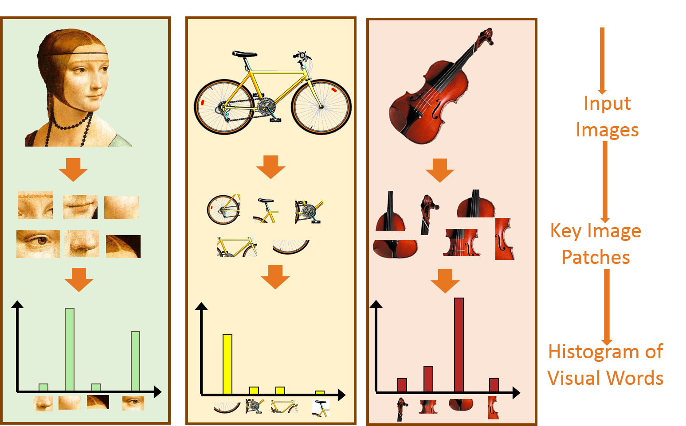

[그림 1] BoVW 개념

## BoVW 알고리즘 설명
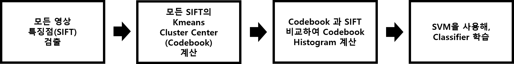 

[그림 2] BoVW의 흐름도

BoVW 알고리즘 흐름을 이해를 위해 그림 2를 살펴 보면 아래와 같은 순서로 진행 된다.

- (1) 각 클래스 사진들의 특징점(SIFT)을 검출한 후 모든 특징점을 모은다.
- (2) 하나로 모은 모든 특징점을 군집화(Kmeans) 하여 대표 Visual Words (혹은 Codebook 이라 부름) 를 선정한다.
- (3) 모든 학습 영상에 대해 Visual Words (Codebook)가 각 영상에 포함된 빈도 (histogram)를 구한다. 이 Histogram 이 2D 영상을 표현하는 1D vector 가 된다.
- (4) 3번 과정을 통해 구한 1D vector (피쳐:Feature)를 SVM으로 학습한다.
- (5) 앞서 구한 Visual Words 를 이용하여 테스트 영상에 대한 Histogram 을 구하고, 이미 학습된 SVM 을 통해 테스트 영상의 종류를 예측한다.

## 1. 영상 특징 추출 (SIFT)

>[Empty Module #2] extract_descriptor 구현 시 참고

- 이미지에서 특징점(visual word)을 추출하는 방법은 여러가지가 있으나 그 중 가장 대표적인 SIFT 알고리즘을 소개한다.
- Local descriptor 라고도 불리우는 특징점(visual word) 추출 알고리즘 SIFT는 이미지 내 물체의 크기와 회전에 강인하도록 설계되었으며, 이미지 내의 특징점(visual word)이 될 위치를 detect(탐지) 하고 이를 describe(기술) 한다.
- 기술된 특징점(visual word)은 128차원의 벡터 형태로 구성되며 이를 특징점으로 사용한다.

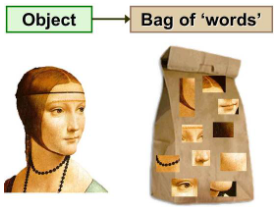

[그림 3] BoVW 설명도: 영상 특징점 검출(words 검출)

- 그림 4-1은 SIFT를 이용해 영상의 특징점을 추출한 예시이다.
- 책을 촬영한 각도, 회전, 조명, 크기가 달라졌어도 책 내부의 비슷한 위치를 특징점으로 가리키는 것을 알 수 있다.
- 이는 SIFT를 통해 특징점을 추출했을 경우 해당 변화 요소들에 불변한 것을 의미하며 주로 이렇게 환경 변화에 강인하게 추출된 특징점들을 군집화하여 대표 Visual Word를 얻는다.

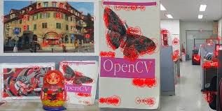

[그림 4-1] SIFT 표현

- SIFT는 영상 내에서 알고리즘을 통해 환경 변화에 강인한 부분을 찾아내고 이를 특징점으로 추출한다.
- 그러나 단색의 벽이나 배경, 혹은 단순 에지의 경우 알고리즘에 의해 특징점으로 추출하지 못하게 되는 경우가 생긴다.
- 이러한 것을 해결하고자, 영상 내의 부분적으로 영상 기술에 도움을 줄 수 있는 정보들을 최대한 활용하기 위해 DenseSIFT가 제안되었다.
- DenseSIFT는 영상 내 일정 간격의 위치를 특징점으로 선정하고 이에 대해 기술한다.
- 영상의 부분 정보를 최대한 활용하기에 SIFT를 사용한 BoVW보다 DenseSIFT를 사용한 BoVW가 더 좋은 성능을 보인다.
- [그림 4-2]는 SIFT와 DenseSIFT의 시각적인 차이를 나타낸다.

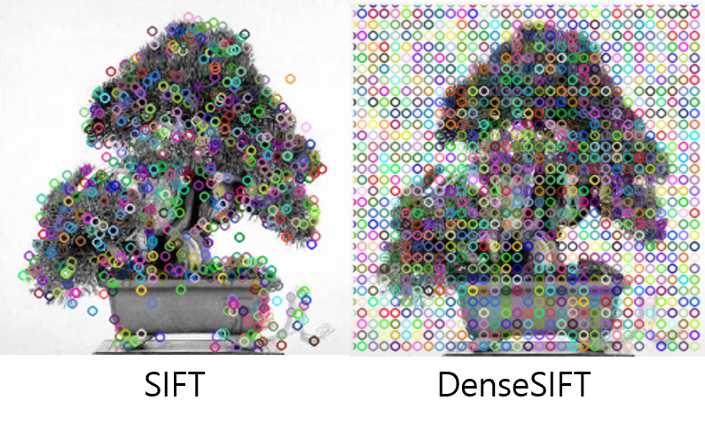

[그림 4-2] SIFT와 DenseSIFT 추출 특징점 방식 비교

## 2. Codebook 생성
- 모든 이미지에서 특징점(visual word)을 추출한 뒤 이들 중 대표가 되는 특징점(codebook)을 선정해야한다.
- 이를 위해 k-means 알고리즘을 사용하며 모든 128차원의 특징점(visual word)을 거리 기준 k개의 군집으로 나누는 방식이며 각 군집의 중심점을 대표 특징점(codebook)으로 사용하는 방식이다.
- 주의할 점은 학습 데이터 셋에서 특징점(visual word)만을 활용해 대표 특징점(codebook)을 선정해야 한다.
- (테스트 데이터 셋에서 얻은 특징점은 codebook의 생성에 관여하면 안된다!!)

**(GPU를 사용해야 하기 때문에 꼭 GPU 를 활성화 한 상태로 코드를 실행해야 한다!)**

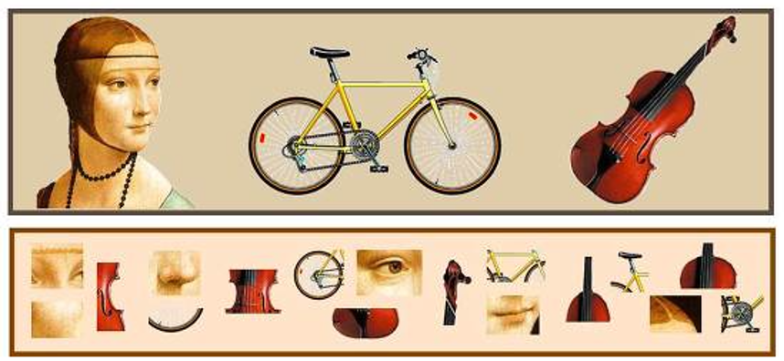

[그림 5] BoVW 설명도

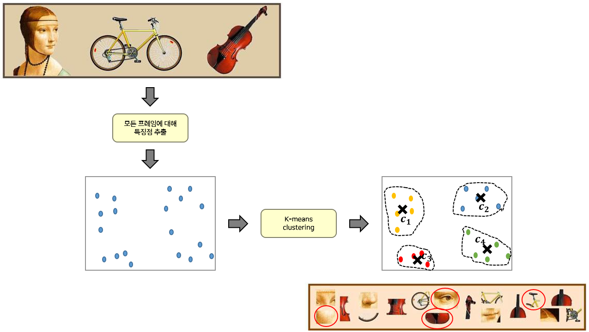

[그림 6] Kmeans clustering을 통한 Codebook 생성

## 3.a (BoVW 기법) Visual words를 이용한 Histogram 생성

  [Empty Module #3] BoVW 구현 시 참고

- 지금부터 이야기하는 Histogram은 영상을 대표하는 정보인 전역 특징량(global feature) 에 해당되며, 개념적으로는 그림 7과 같다.
- 즉, 사람 얼굴 영상은 눈 2개, 코1개로, 자전거 영상은 안장 1개 바퀴 2개로 히스토그램이 구성된다는 것이다.

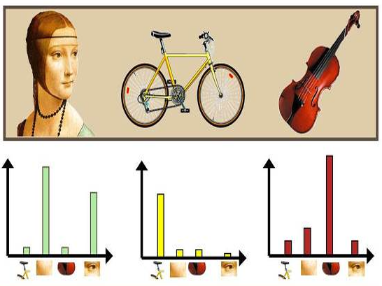

[그림 7] BoVW 설명도

- Histogram Visual words (혹은 Codebook)를 이용하여 영상을 대표하는 Histogram을 구하는 방법을 구체적으로 이야기 하면, 각 영상의 모든 특징점과 codebook을 비교하여, 그 특징점과 가장 유사한 Visual words 의 도수(히스토그램의 Y축)를 높히는 것이다.
- 영상의 모든 특징점(SIFT descriptor)과 codebook을 비교(L2 distance를 구하여 가장 거리 값이 작은 것)하여 histogram을 생성하면 된다.

## 3.b (VLAD 기법) VLAD(Vector of Locally Aggregated Descriptors) 피쳐 추출 방법
>[Empty Module #4] VLAD 구현 시 참고

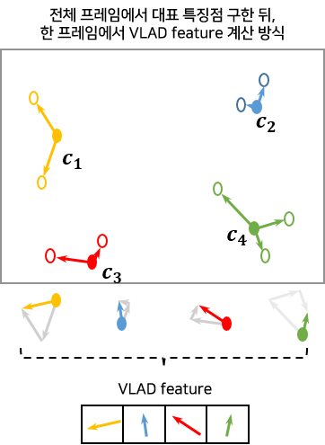

[그림 8] VLAD 기술자 원리

- BoVW에서는 대표 특징점에 대한 분포를 각 이미지마다 계산해 히스토그램 형식의 feature를 사용한다면,
- VLAD는 각 이미지 내의 특징점(visual word)들을 대표 특징점(codebook)에 거리 순으로 할당해 둘 간의 벡터 차이를 계산한 후 동일한 대표 특징점(codebook)에 할당된 특징점(visual word)의 벡터 차이 값을 모두 더해주는 방식으로 feature를 기술하는 방식이다.
- 이로 인해 BoVW 에서 사용한 특징점(visual word) 추출, 대표 특징점(codebook) 선정까지의 방식은 동일하게 사용된다.
  - 2번 과정까지는 동일하게 진행되고, 3번 과정에서 3.a와 3.b로 구분된다)
## ++ <3.a (BoVW), 3.b (VLAD) 피쳐 추출 시 적용 가능한 Spatial Pyramid Matching 기법>
>[Empty Module #5] cut_image 구현 시 참고

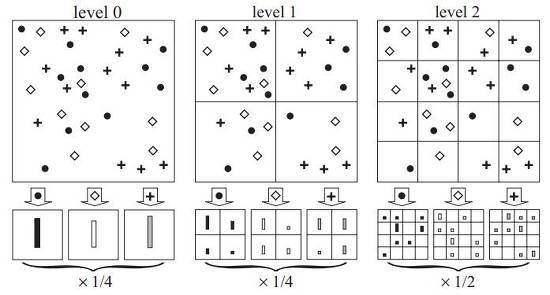

[그림 9] Spatial Pyramid Matching 기법

- 기존 BoVW와 VLAD 방법론은 기본적으로 [그림 9-level 0] 에서 보는 것과 같이 최종 기술자 추출을 위해 이미지 전체에 대해 한번만 계산을 수행한다.
- 반면, 소개할 Spatial Pyramid Matching 방법은 이미지를 여러 단계의 resolution으로 분할한 후 각 단계의 분할 영역 모두를 고려하여 기술자를 추출하게 된다.
- [그림 9]를 보게 되면 Spatial Pyramid Matching 방법에서는 level 0 뿐만 아니라 추가적으로 이미지를 점진적으로 세분(level 1에서는 2x2로 분할, level 2에서는 4x4로 분할, …)해 가면서 각각의 분할 영역마다 기술자를 추출해서 합치게 된다.
  - 3.a의 BoVW 방법론에 적용 시 level 0, 1, 2 각각에서 별도로 히스토그램을 구한 후 , 이들 히스토그램들을 전부 모아서 일종의 피라미드(pyramid)를 형성한다.
  - 그리고 이렇게 형성된 히스토그램 피라미드들을 합쳐서 최종적으로 기술자를 추출하게 된다.
  - 여러 resolution에서 구해진 각각의 히스토그램을 모두 합쳐서 한번에 사용한다고 생각하면 된다.

**Spatial Pyramid Matching 기법의 등장 배경???**
- 기존 Bag of Visual Words 방법은 기본적으로 feature들의 히스토그램(histogram)으로 이미지를 표현한다.
- 그렇기 때문에 추출한 feature들 간의 기하학적인 위치 관계를 잃어버리는 문제점을 가지고 있다.
  - 물론 동물 등과 같이 변형이 심한 물체를 인식하는데는 이 특성이 오히려 장점으로 작용한다.
  - 하지만 자동차 등과 같이 형태가 고정된 물체의 경우에는 성능저하의 큰 요인 중 하나가 될 수 있다.
- 이를 해결하기 위해 이미지를 점진적으로 분할해서 각 분할 영역마다 기술자를 추출해서 합치는 Spatial Pyramid Matching 기법이 등장했다.
  
## 4. SVM 분류기 학습하기

>[Empty Module #6] SVM 구현 시 참고

- BoVW, 혹은 VLAD를 통해 기술된 feature vector 를 이용해 분류 모델 학습을 진행할 때, 여러분들이 배운 다양한 분류 모델을 적용해 볼 수 있다.

- 그러나 이번 프로젝트에서는 Bovw와 가장 잘 어울리기로 소문난 SVM 을 사용하기로 한다.

- 여러분도 잘 알고 있다시피, SVM은 결정 경계(Decision Boundary) 즉 분류를 위한 기준 선을 정의하는 모델이며, 이 모델은 그림 8의 margin 즉 선과 데이터의 최단 거리가 최대로 하기 위한 결정 결계를 찾는 것을 목표로 한다.

- SVM 을 통해 학습 데이터 간의 결정 경계를 찾고 이를 활용해 테스트 영상의 클래스를 분류한다.

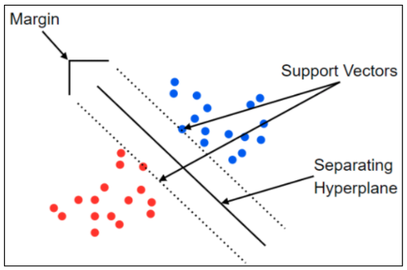

[그림 10] SVM

## 5. 학습 모델을 이용하여 평가 영상 맞추기
평가 영상의 라벨(클래스)을 추정하기까지의 과정을 요약하자면 아래와 같다.

### [모델 학습]
1. 학습 영상들의 특징점(SIFT or Dense SIFT) 검출
2. 추출된 학습 데이터의 특징점들을 군집화하여 대표되는 특징점을 모아 Codebook 생성 : K-means Clustering
3. 생성된 Codebook과 각 학습 데이터마다의 특징점들을 비교해 Histogram 기술자 생성
4. 학습 데이터의 Histogram 기술자로 SVM의 결정 경계 학습 : SVM
### [모델 추론]
5. 평가 데이터의 특징점(SIFT or Dense SIFT) 추출
6. 학습 데이터로 생성된 Codebook과 각 평가 영상 내 특징점들을 비교해 Histogram 생성
7. 학습 데이터로 기 학습된 SVM을 이용해 평가 데이터의 Histogram 기술자가 속하는 그룹을 선정하고 해당 그룹의 라벨을 할당
8. 평가 데이터의 라벨 CSV 파일로 기록