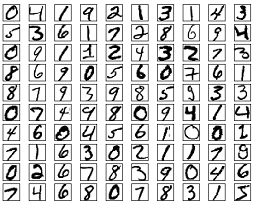
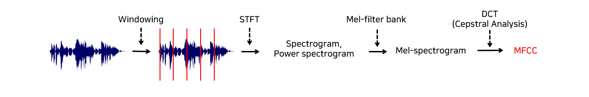
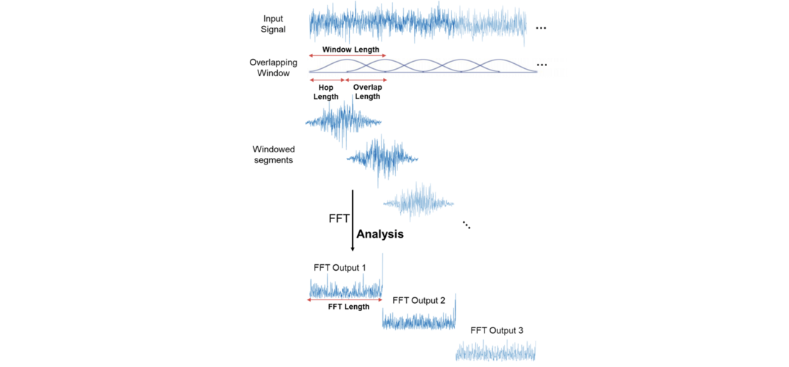

# 문제 1. 

## 문제 설명
- 타이타닉 호의 침몰은 역사상 가장 악명 높은 해상 재난 중 하나입니다.

- 1912년 4월 15일, 첫 항해를 시작한 RMS 타이타닉은 얼음산과 충돌 후 침몰하였습니다. 불행하게도 모든 승객과 승무원들을 수용할 수 있는 구명보트가 충분하지 않아 2224명 중 1502명이 사망하였습니다.

- 생존에는 어느 정도의 운이 있었지만, 일부 그룹의 사람들은 다른 사람들보다 더 많은 생존 가능성이 있었습니다.

- 이번 문제에서는 승객 데이터 (이름, 나이, 성별, 사회 경제적 계층 등)를 사용하여 "어떤 종류의 사람들이 생존 가능성이 높았는가?"라는 질문에 대한 예측 모델을 구축해 보도록 합시다.

- 'Cabin' 에 해당되는 열은 두가지 선택지가 있습니다.
- 'C10' -> 'C' : 앞글자만 사용하기 (선실의 호수는 그렇게 중요하지 않고 등급이 중요)
- drop 시키기 : 결측치가 너무 많기 때문에 drop 시키는 것도 하나의 옵션이 될 수 있습니다.
- 'PassengerId', 'Name', 'Ticket' 에 해당되는 열은 베이스라인의 경우 drop 시켰습니다.

# 문제 2.

## 문제 설명
- MNIST는 간단한 컴퓨터 비전 데이터 세트로, 아래와 같이 손으로 쓰여진 이미지들로 구성되어 있습니다. 숫자는 0에서 1까지의 값을 갖는 고정 크기 이미지 (28x28 픽셀)로 크기 표준화되고 중심에 배치되었습니다. 간단히 하기 위해 각 이미지는 평평하게되어 784 피쳐의 1-D numpy 배열로 변환되었습니다 (28 * 28).

- 픽셀 값에 해당하는 784 피쳐의 1-D numpy 배열을 활용하여 손으로 쓰여진 글자를 인식하는 예측 모델을 구축해 보도록 합시다.

# 문제 3.

## 문제 설명
한국토지주택공사는 빅데이터 분석을 통해 잔반 발생량을 획기적으로 줄이고자 한다. 여러분은 지금부터 수업 시간에 배운 <머신러닝 기술>을 활용하여, 구내식당의 요일별 점심 식사를 먹는 인원을 예측하는 인공지능 SW를 작성해주길 바란다.

자, 그럼 테스트 데이터로 주어진 (회사 직원 정보와 식당 메뉴)를 가지고 요일별 (점심 식사 인원 수)를 예측하여 봅시다.

데이터에 같이 제공된 menu.json을 활용하여 메뉴 구성에 대한 전처리를 수행할 수 있습니다.

    import json

    with open("/kaggle/input/2023-ml-finalexam-pp3/menu.json") as f:
        total_menu = json.load(f)

## 베이스라인 설명

베이스라인 1의 경우 메뉴 데이터(조식,중식,석식)에 대한 복잡한 전처리 없이, column을 drop 하는 것만으로 성능을 달성할 수 있습니다.

베이스라인 2의 경우 메뉴 데이터(조식,중식,석식)에 대해서 total_menu를 활용해 BoW 형식으로 전처리를 수행하면 달성할 수 있습니다.

베이스라인 1에서 기술한 feature와 Bow_feature를 concat 하여 사용하면 더욱 높은 성능을 기대할 수 있습니다.

    train=pd.read_csv('/kaggle/input/2023-ml-finalexam-pp3/train.csv')

    train_BoW_feature = list()

    for idx in range(len(train)):
        menu_list = list()
        BoW = np.zeros((len(total_menu)))
        for col in ['조식메뉴','중식메뉴','석식메뉴']:
            menu_list.extend(train[col].iloc[idx].split(' '))
        menu_list = set(menu_list)
        menu_list.remove('')
        for menu in menu_list:
            idx =  # 텀프로젝트 내용을 활용해서 필요한 코드를 작성하세요.
            BoW[idx] = # 텀프로젝트 내용을 활용해서 필요한 코드를 작성하세요.
        train_BoW_feature.append(BoW)

    train_BoW_feature = np.array(train_BoW_feature)

# 문제 4. 음성/음악 데이터 다루기 - 장르 분류기

본 텀프로젝트에서는 음악 데이터에 대한 handcrafted feature인 MFCC feature를 추출하여 총 10가지의 음악 장르를 분류하는 것을 목표로 합니다.

MFCC는 Mel Frequency Cepstral Coefficient의 약자입니다. 다양한 음성 feature가 존재하지만, MFCC는 사람의 청각 기관 특성을 가장 잘 살려 설계된 feature 중 하나에 해당하고 현재까지도 음성, 음악 관련 task를 수행하기 위해 많이 사용됩니다.

MFCC feature는 음성 관련 라이브러리인 librosa와 numpy만으로 모두 구현할 수 있습니다.

아래 설명을 천천히 읽고, 스켈레톤 코드 내의 Empty Module #1, Empty Module #2를 채워 베이스라인 점수를 달성하시면 됩니다.

자세한 설명은 아래에서 이어가도록 하겠습니다.

## [Empty Module # 1] MFCC 추출
첫 번째 Empty Module에서는 각 음악 파일에 대한 MFCC feature를 추출하는 함수 extract_mfcc_feature()를 구현합니다.

위 그림은 이번 기말고사 5번 문제에서 구현할 MFCC feature의 대략적인 추출 흐름도입니다. 아래에 각 단계별 의미와 이를 구현하기 위해 사용해야하는 함수가 설명되어 있으니 반드시 꼼꼼하게 읽고 구현해주시기 바랍니다.

### 1. 샘플링

구현에 필요한 함수: librosa.load()

연속적인 음성은 아날로그 데이터이기 때문에 컴퓨터에 입력시키기 위해서는 디지털 정보로 표현해주어야 합니다. 이 때 아날로그 데이터를 무한히 쪼갤 수는 없으므로 기준을 세워 대표값으로 쪼개 사용하는데, 이 과정을 샘플링(Sampling)이라고 합니다. 샘플링은 주로 시간 도메인을 기준으로 이루어집니다. 샘플링 레이트(sampling rate)는 1초당 추출되는 샘플의 개수입니다.

사람의 가청 주파수 영역을 고려한 표준 샘플링 레이트는 44100Hz인데, 이는 1초를 44100등분하여 오디오 데이터를 이산화하는 것을 의미합니다. 샘플링 레이트를 높여 잘게 쪼갤수록 음성 데이터의 정보 손실은 줄어들지만, 데이터의 크기가 늘어날 것입니다. 본 문제에서는 샘플링 레이트를 22050Hz로 지정하여 음악 파일에 대한 샘플링을 수행합니다.

### 2. STFT(Short Time Fourier Transform)
Windowing 과정을 거쳐 잘게 나누어진 프레임들에 각각 STFT(Short Time Fourier Transform)를 적용한 뒤, 기타 연산을 통해 주파수 도메인으로 변환된 power spectrogram을 얻는 과정을 거칩니다. 이에 대해서는 아래에서 계속 설명드리겠습니다.

구현에 필요한 함수: librosa.stft(), np.abs(), np.power()

STFT는 음성 신호의 시간적 정보를 잘 활용하기 위해 각 프레임마다 FFT(Fast Fourier Transform)을 적용하여 시간 도메인의 데이터를 주파수 도메인으로 변환해주는 과정입니다. 일정 시간 영역에는 수많은 주파수가 혼합되어 있어 정보를 분석하기 어렵기 때문에 음성의 고유 배음구조를 유추할 수 있도록 신호를 위 그림과 같이 주파수 영역으로 변환시켜주는 것입니다.

FFT를 음성의 전체 시간 영역에 한 번에 적용하게 되면 음성의 시계열적 특성 정보를 제대로 활용할 수 없게 됩니다. 따라서 전체 시간 영역에 대해 FFT를 한 번에 적용하는 것이 아닌, 위 그림과 같이 잘게 나뉜 영역에 대해 여러 번(총 window 개수만큼) FFT를 적용하여 주파수 도메인으로 변환(=STFT)해준다면 주파수 정보 뿐만 아니라 시간적 순서와 관련된 time frame에 대한 정보까지 얻을 수 있게 됩니다.

STFT를 적용하여 얻은 값(=spectrum)의 magnitude를 사용하기 위해 절대값을 취하여 spectrogram을 얻고, 이렇게 얻은 spectrogram을 제곱하여 power spectrogram을 얻습니다. 다음 함수의 입력으로 spectrogram이 아니라 power spectrogram이 사용되는 이유는 주파수 도메인에서 시간에 따른 신호의 에너지를 강조해줄 수 있기 때문입니다. 제곱을 함으로써 음악 신호의 패턴을 더 쉽게 감지하고, 음악에서 특징점이 될 수 있는 부분을 잡아내는 데에 더욱 도움되는 값을 얻어낼 수 있는 것입니다.

### 3. Melspectrogram

구현에 필요한 함수: librosa.feature.melspectrogram() (함수명을 클릭하면 각 함수에 대한 라이브러리 공식 문서로 연결됩니다.)

실제로 사람의 달팽이관은 저주파 대역을 감지하는 부분은 굵고, 고주파 대역을 감지하는 부분은 얇습니다. Melfilter는 이렇게 사람의 청각기관이 높은 주파수보다 낮은 주파수 대역에 더욱 민감하게 반응한다는 사실을 반영하여 power spectrogram을 조정하는 역할을 수행합니다.

위 그림은 melfilter인데 상대적으로 높은 주파수 대역으로 갈수록 필터가 감소하는 것을 볼 수 있습니다. 이를 적용해 사람이 더욱 민감하게 반응하는 주파수 대역을 강조한 값으로 변환된 melspectrogram을 얻을 수 있게 됩니다.

Melspectrogram은 이전 단계에서 추출한 power spectrogram을 melspectrogram 함수의 입력으로 주어 추출할 수 있습니다.

### 4. Cepstral analysis & MFCC feature extraction

다음은 앞서 얻은 melspectrogram에 켑스트럴 분석 과정을 적용하고 이를 통해 최종적인 MFCC feature를 얻을 수 있습니다.

좀 더 풀어서 설명하자면 melspectrogram을 log scale로 만들어 log spectrogram을 얻고, 이에 DCT(Discrete Cosine Transform)를 적용하여 최종 MFCC feature를 추출하게 되는 것입니다.

구현에 필요한 함수: librosa.power_to_db(), librosa.feature.mfcc() (함수명을 클릭하면 각 함수에 대한 라이브러리 공식 문서로 연결됩니다.)

먼저 melspectrogram을 log scale로 만드는 이유는, 사람의 소리 인식이 log scale에 가깝기 때문입니다. 다시 말해 사람이 두 배 큰 소리라고 인식하기 위해서는, 실제로 에너지가 100배 큰 소리여야 한다는 특성을 feature 추출 과정에 적용해주었다는 뜻입니다. 이렇게 사람의 청각기관을 고려하여, power 스케일의 melspectrogram을 db 스케일의 melspectrogram으로 변환하는 것이 본 과정의 목적입니다.

다음으로 DCT는 대부분의 실제 신호가 우함수이기 때문에 입력신호를 우함수인 코사인 함수의 합으로 표현해주는 과정입니다. DCT의 변환 결과는 계수 형태로 나타나며, db 스케일의 melspectrogram에 DCT를 적용했을 때 주파수 성분으로 분해하여 얻은 계수 중 주로 사용되는 일부 계수들만 선택하면 그것이 MFCC feature로서 사용되는 것입니다. 본 과정은 librosa.feature.mfcc() 함수에 앞서 추출한 db 스케일의 melspectrogram을 입력으로 줌으로써 수행할 수 있습니다.

## [Empty Module # 2] 분류기 설계 및 테스트 수행

두 번째 Empty Module에서는 분류기(RandomForestClassifier)를 선언하고 학습 데이터에 대한 fit 및 테스트 데이터에 대한 예측을 수행합니다.

