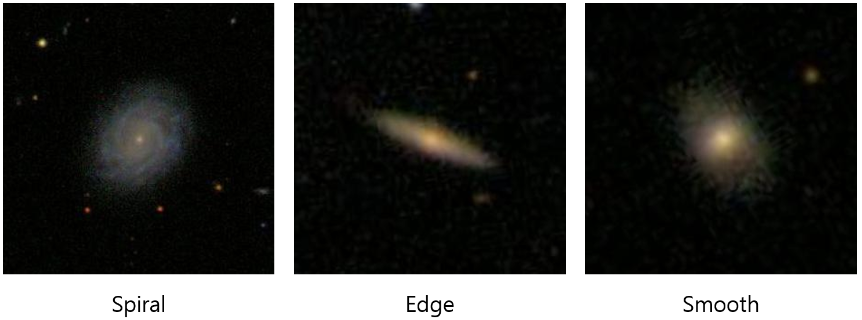

# 과제 5-1 은하계 종류 예측
은하계는 관측 후 형태에 따라 분류되어집니다. 은하계를 분류해봅시다.

## 데이터 셋 설명
다음과 같이 3가지 종류의 은하계 데이터 셋이 제공됩니다.

Spiral 은하는 일반적으로 알려진 나선 형태의 은하를 의미합니다.
Edge 은하는 나선 은하지만 관측 방향에 의해 뾰족한 형태를 띄는 은하를 의미합니다.
Smooth 은하는 은하 디스크의 두께가 얇지 않고 두껍게 보이는 은하를 의미합니다.

학생 여러분의 편의를 위해 각 은하계 사진은 1D Feature로 가공되어 제공합니다. 지금부터 간략하게 설명할 2D 영상을 1D로 표현하기 위한 방법은 기계학습 수업의 범주를 벗어나오니 참고만 하시길 바랍니다.

각 사진은 ImageNet으로 pretrained된 VGG16을 활용하여 1-Dim의 벡터로 제공됩니다. 이 벡터는 종단 두 개의 FC Layer를 통해 나온 4,096 차원의 벡터에 PCA를 사용해 64차원으로 가공되어 제공됩니다.
학습 데이터는 총 6,000개, 평가 데이터는 총 1,500개이며 학습 데이터에 해당하는 분류 정보도 같이 제공됩니다.

## Evaluation
- 평가 데이터 1,500개에 대해 총 3개 종류의 은하계로 분류합니다. - 분류 결과는 같이 제공된 sample_submit.csv의 형식에 맞춰 제출해야하며, 소문자로 구성된 string 형식을 따라야 합니다.
- 제출된 평가 데이터의 예측 분류 값에 대한 성능은 Categorical Accuracy로 측정됩니다. #### 분류 결과 예시: edge, smooth, sprial 

## Baseline
현재 베이스라인은 Logistic Regression의 디폴트 옵션을 사용합니다.

Logistic Regression의 디폴트 옵션 (solver='lbfgs')은 데이터 셋에 따라 max_iter=100에는 수렴하지 못하는 Warning이 발생합니다. 그러므로, 디폴트 옵션에서 max_iter을 1000으로 설정하시길 바랍니다.

반드시 하이퍼파라미터를 변경하면서 파라미터 변화에 따른 성능을 분석해보시길 바랍니다.

현재 문제의 경우 랜덤시드 설정유무로 성능의 변동은 없습니다만, 지금부터 랜덤시드를 고정시키는 연습을 하고자 아래의 코드를 캐글 노트북에 추가하여 사용해주시기를 바랍니다.

    import random
    import os

    seed = 42

    random.seed(seed)
    np.random.seed(seed)
    os.environ["PYTHONHASHSEED"] = str(seed)
---
# 과제 5-2 수면시간에 따른 우울증 에측

본 데이터 셋은 다트머스 대학교 학생들에게 수집한 설문조사를 토대로 만들어진 데이터 셋입니다.

## 데이터 셋 설명
본 데이터 셋은 다트머스 대학교 학생들을 대상으로 일정 기간 학생들에게 스마트폰 센서 데이터와 다양한 설문조사 결과를 포함하고 있습니다. 그중 본 실습문제에서는 학생들이 응답한 '수면시간 및 수면의 질' 관련 설문조사와 'PHQ-9' 설문조사를 사용할 예정이며, 이를 통해 수면시간 및 수면의 질을 통해서 우울증의 유무를 판단할 예정입니다. 본 데이터 셋을 제공한 연구팀은 학생들에게 수면과 관련해 다음과 같은 질문을 진행하였습니다.

1. "How many hours did you sleep last night?"
2. "How would rate your overall sleep last night"

그리고 이러한 질문에 대해서 학생들은 설치된 어플리케이션을 통해서 설문조사에 응하였고, 이와 관련된 데이터 셋의 자세한 내용은 Student Life Dataset에서 확인할 수 있습니다. 본 문제에서는 사전에 이러한 설문조사 응답에 대해서 전처리를 진행하였고, 학생들의 수면 시간, 수면의 질에 대한 응답에 대해서 Pandas describe 함수를 이용해 학습에 사용할 Feature를 설계하였습니다.

따라서 여러분은 추가적인 데이터 전처리 없이 제공되는 Feature를 기존 머신러닝 방법을 통해서 학습하고, 평가를 수행하면 됩니다. Feature에 대한 자세한 설명은 Data를 참고하세요.

## Evaluation
우울증 유/무 분류 예측을 위해 Categorical Accuracy를 사용하고 있습니다.
Baseline (필독)
현재 베이스라인은 Logistic Regression의 디폴트 옵션을 사용합니다.

반드시 하이퍼파라미터를 변경하면서 파라미터 변화에 따른 성능을 분석해보시길 바랍니다.
현재 문제의 경우 랜덤시드 설정유무로 성능의 변동은 없습니다만, 지금부터 랜덤시드를 고정시키는 연습을 하고자 아래의 코드를 캐글 노트북에 추가하여 사용해주시기를 바랍니다.

    import random
    import os

    seed = 42

    random.seed(seed)
    np.random.seed(seed)
    os.environ["PYTHONHASHSEED"] = str(seed)